## NuScale Power First Quarter 2026 Earnings Presentation

May 2026

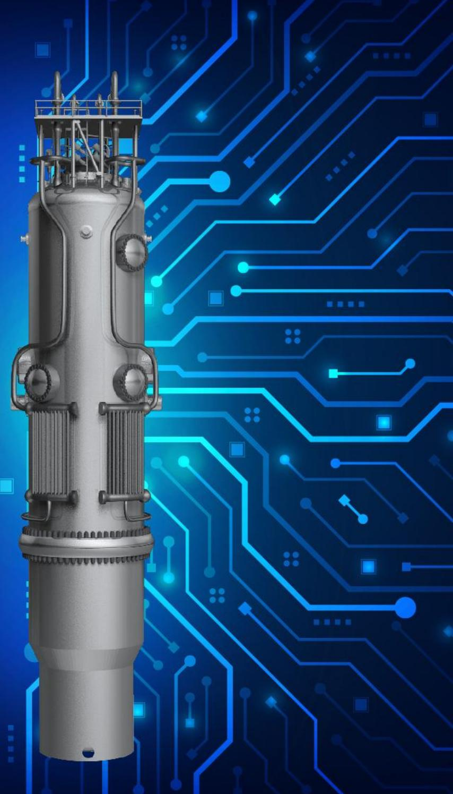

## Forward-Looking Statements

This Presentation contains forward-looking statements (including without limitation statements containing words such as "will," "believes," "expects," “anticipates,” "plans" or other similar expressions). These forward-looking statements include statements relating to our strategic and operational plans, expectations (including regarding our market positioning, our progress toward deploying our technology, the RoPower plant, the market for nuclear energy and providing energy technology for communities around the world), future growth, and the outlook of our business.

Actual results may differ materially as a result of a number of factors, including, among other things, the following: our status as a holding company; our ability to enter into binding contracts with customers to deliver NPMs: competition from other nuclear reactor technologies: delays in the development and manufacturing of NPMs and related technology: the possibility that we may incur losses in the future and may not be able to achieve or maintain profitability; the cost of electricity generated from nuclear sources or our NPMs may not be cost competitive; the market for SMRs is not yet established and may not achieve growth as expected; our dependence on our relationships with ENTRA1, Fluor and other strategic investors and partners; risks related to the Partnership Milestones Agreement entered into by NuScale Power, LLC and ENTRA1 on August 27, 2025; our supply base is constrained; our ability to manage our growth effectively; our need for additional funding in the future; manufacturing and construction issues; loss of government funding; the politically sensitive environment we operating in and the public perception of nuclear energy; our dependence on senior management and other highly skilled personnel; our ability to obtain design approvals internationally; our customers’ ability to obtain required regulatory approvals on a timely basis or at all; compliance with environmental laws and evolving government laws and regulations; the impact of changing trade policies and new or increased tariffs; risks related to cybersecurity; changes in tax laws; our ability to protect our intellectual property; our limited number of authorized shares available for issuance; the price of our Class A common stock may be volatile; additiona sales of our common stock or exercise of our options could result in dilution to our stockholders; we have and may in the future be subject to short selling strategies; NuScale Power, LLC being treated as a corporation for U.S. federal income tax or state tax purposes; and requirements under the Tax Receivable Agreement. Caution must be exercised in relying on these and other forward looking statements. Due to known and unknown risks, our results may differ materially from its expectations and projections.

Additional information concerning these and other factors can be found in the Company's public periodic filings with the Securities and Exchange Commission, including the general economic conditions and other risks, uncertainties and factors set forth in the sections entitled “Risk Factors” in our Annual Report on Form 10-K for the year ended December 31, 2025 and in Part II, Item 1A "Risk Factors" of the Form 10-Q for the quarter ended March 31, 2026. The referenced SEC filings are available either publicly or upon request from NuScale's Investor Relations Department at ir@nuscalepower.com. The Company disclaims any intent or obligation other than as required by law to update or revise any forward-looking statements.

## Other Items

This Presentation may contain trademarks, service marks, trade names and copyrights of other companies, which are the property of their respective owners. Solely for convenience, some of the trademarks, service marks, trade names and copyrights referred to in this Presentation may be listed without the TM, SM, © or ® symbols, but the Company will assert, to the fullest extent under applicable law, the rights of the applicable owners, if any, to these trademarks, service marks, trade names and copyrights.

## NuScale is Years Ahead of the Competition

<table><tr><td rowspan="2">Selected Differentiators</td><td rowspan="2">NUSCALE</td><td colspan="2">Small Modular Reactor Competitors1</td></tr><tr><td>Other Light Water Reactors</td><td>Non-Light Water Reactors2</td></tr><tr><td>Regulatory Leadership: U.S. NRC Licensing</td><td>√ Standard Design Approval in 2020√ Design Certification in 2023√ Second Standard Design Approval in 2025</td><td>None (applications not yet submitted)</td><td>None (applications not yet submitted)</td></tr><tr><td>Fuel Supply Availability &amp; Infrastructure</td><td>√ Exists (50+ years history)√ Commercially available LEU fuel &lt; 5%</td><td>Same as NuScale</td><td>Does not commercially exist today in North America; Under development</td></tr><tr><td>Modularity Manufacturing Infrastructure</td><td>√ Multiple suppliers for all critical components</td><td>In development</td><td>In development</td></tr><tr><td>Underlying Technology Track Record</td><td>√ Light water reactor (LWR) (50+ years history)</td><td>LWR design with both PWR and BWR applications</td><td>Relatively limited to no commercial application</td></tr><tr><td>Safety: Emergency Planning Zone</td><td>√ At site boundary – only nuclear technology approved by U.S. NRC</td><td>To be determined – not reviewed by U.S. NRC</td><td>To be determined – not reviewed by U.S. NRC</td></tr><tr><td>Safety: Coping Period</td><td>√ Unlimited – approved by U.S. NRC</td><td>Varies; Goal of between 7 days and unlimited</td><td>Goal of unlimited coping</td></tr><tr><td>Unparalleled Capabilities</td><td>√ Innovations including black-start, island mode, off-grid operation, water-smart, behind-the-meter – U.S. NRC approved</td><td>To be determined – challenged by design</td><td>To be determined – challenged by design</td></tr></table>

1. Does not include micro reactors  
2. For example, high temperature gas cooled, molten gas cooled, molten salt, sodium cooled, and fast-reactor technology

## U.S. NRC-Approved Safety Case

## Plant Structural Safety

## Barriers

Water in reactor pool

Biological shield covers each reactor

Reactor building

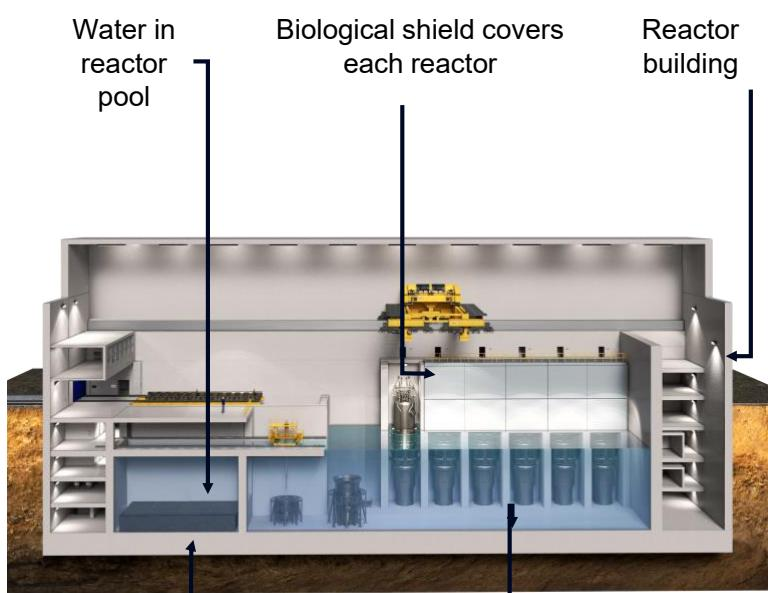

Stainless steel-lined concrete reactor pool

Module barriers

Passive Safety✓ . Additional Fission Product Barriers✓ . ✓ Significant Delay in Release of Radiation.

## Site Boundary EPZ Benefits

ENTRA1 Energy PlantTM with NuScale Technology: Virtually no publicly accessible area is subject to proactive action planning by the licensee

## NuScale EPZ

(at Site Boundary)

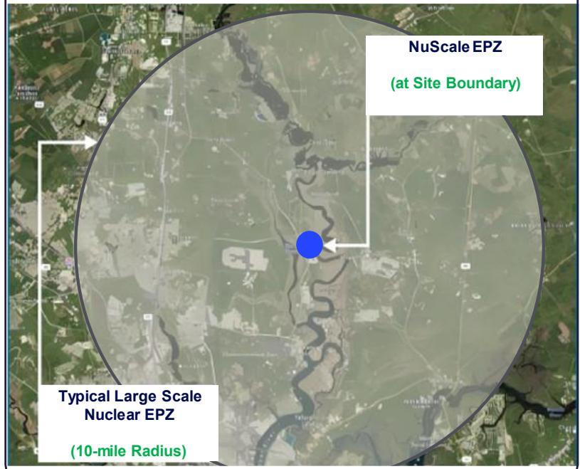

Typical Large Scale Nuclear EPZ (10-mile Radius)

## NuScale Difference: Site Flexibility & Safety

Passively Safe

Cooling water circulates through the nuclear core by natural convection eliminating the need for pumps

Seismically Robust

System submerged in a below-grade pool of water in an earthquake and aircraft impact resistant building

Simple and Small

Integrated reactor design: no large-break loss-of-coolant accidents

No Operator Action Needed

No operator action needed to shut down reactors & no need to add water to keep reactors safe and cooled

Safety Barriers

Additional fission product barriers that provide significant delay in release of radiation

No External Power Needed

Start up from cold conditions without external power

## NuScale First Quarter Highlights

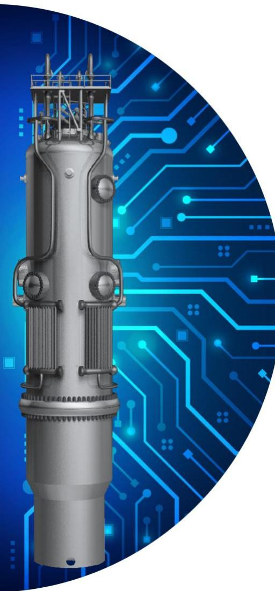

NuScale’s exclusive global strategic partner, ENTRA1 Energy (“ENTRA1”), continues its work with Tennessee Valley Authority (“TVA”) to progress planning for what would be the largest nuclear power deployment program in U.S. history which will utilize NuScale technology

In February 2026, shareholders of SN Nuclearelectrica SA agreed to advance the RoPower project in Doicești, Romania to the next phase

NuScale and Framatome expanded their longstanding global supply chain partnership across the United States and Europe to support accelerated fuel delivery

NuScale maintained its strong liquidity position ending the first quarter of 2026 with \$1 billion in liquidity and capital resources

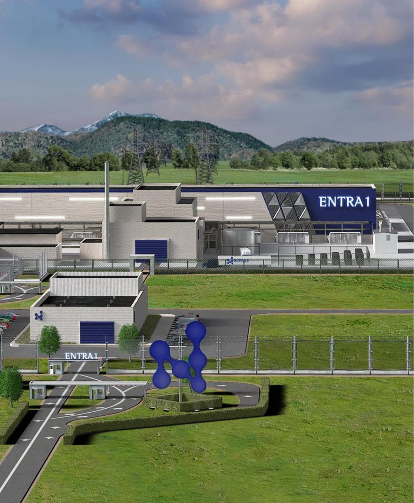

## TVA and ENTRA1 Energy SMR Deployment Program Update

TVA and ENTRA1 Energy announced plans to develop 6 GWe of new nuclear capacity using NuScale Power Modules™

Program is poised to catalyze deployment of NuScale’s SMR technology

ENTRA1 has indicated that they are continuing to progress toward a power purchase agreement with TVA

ENTRA1 is positioned to receive investment capital to help supply large-scale baseload power infrastructure under the \$550 billion U.S.-Japan Framework Agreement

## RoPower Project Update

RoPower selected NuScale as the technology for their SMR modular reactor project to deploy a power plant with 6 NuScale Power Modules™ at a former coal plant site in Doicești, Romania

All services associated with the Phase 2 Front-End Engineering and Design (“FEED”) work led by Fluor were completed in late 2025

On February 12, 2026, shareholders of SN Nuclearelectrica SA agreed to advance the RoPower project to the next phase enabling the project to seek financing to further feasibility studies and site-specific design work prior to construction moving forward

Should pre-EPC financing be secured NuScale looks forward to continuing its involvement in the next phase of the project

## RoPower NUCLEAR

## Established Supply Chain Ecosystem

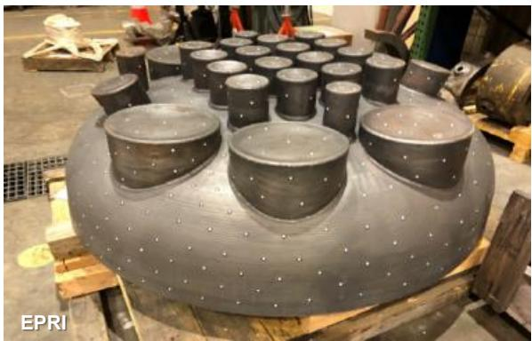

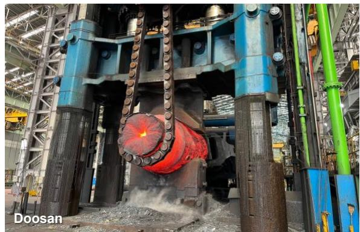

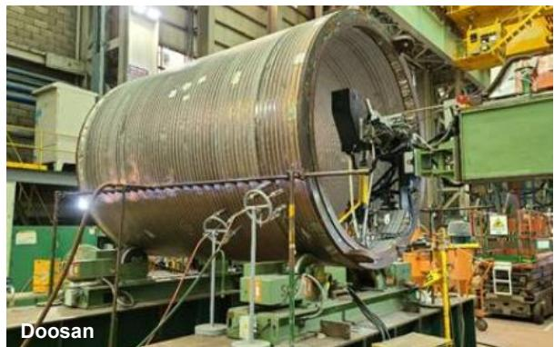

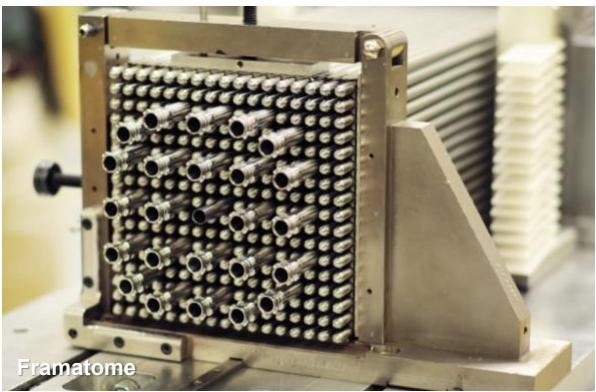

Fuel Assemblies

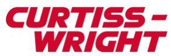

  
Module Protection System  
Sensors and Instrumentation  
Reactor Building Crane

Control Systems

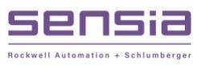

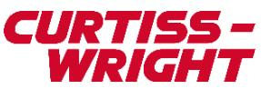

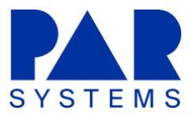  
All images provided by supply chain vendors and used with permission.

## Office of Technology Engagement

• NuScale participated in 5 major industrial international conferences, engaging with the Oil & Gas, Petrochemical, Chemical, Energy, Research and Hyperscaler communities.

• World Petrochemical Conference (WPC): From Concept to Commercial Reality, development of a process steam demonstrator

World Chemical Forum: NuScale Small Modular Reactors

Southwest Research Institute: Industrial Process Emerging Technologies (IPER)

National Academy of Engineering: Closing Strategy Gaps for the Future of AI

CERAWEEK: Energy conference, engaged C-level executives

• Dr. Dirk Smit, NuScale technical advisor and former Chief Science Officer for Shell, joined the conferences

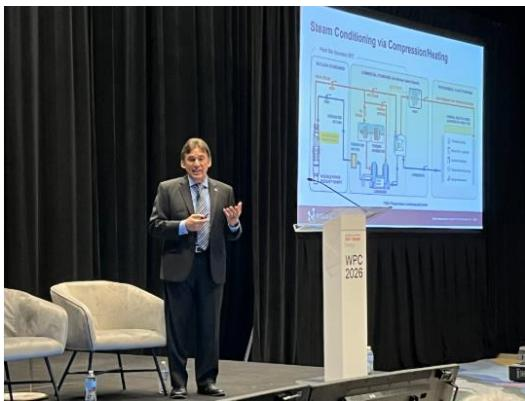

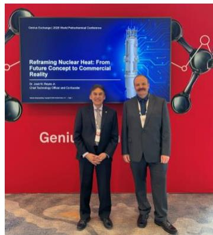  
At WPC, Dr. Reyes presented how NuScale-generated high-temperature steam is becoming a commercial reality, and joined Ebara Elliott Energy’s Shane Harvey to highlight the new partnership during the Genius Exchange.

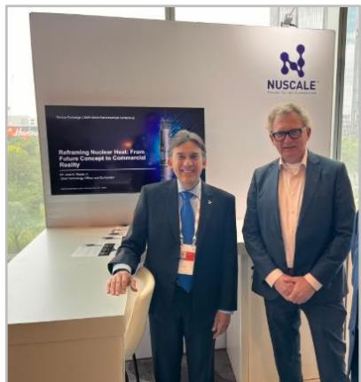  
At WPC, Dr. Smit and Dr. Reyes spent time at the NuScale booth

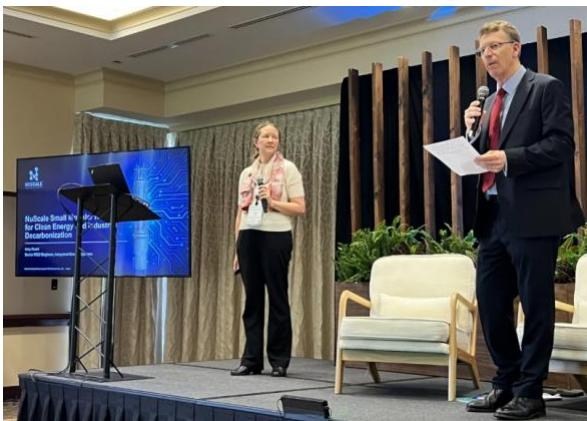  
Amy Kozel presented at the World Chemical Forum

## Key Financial Updates

Liquidity & Capital Resources (\$M)  
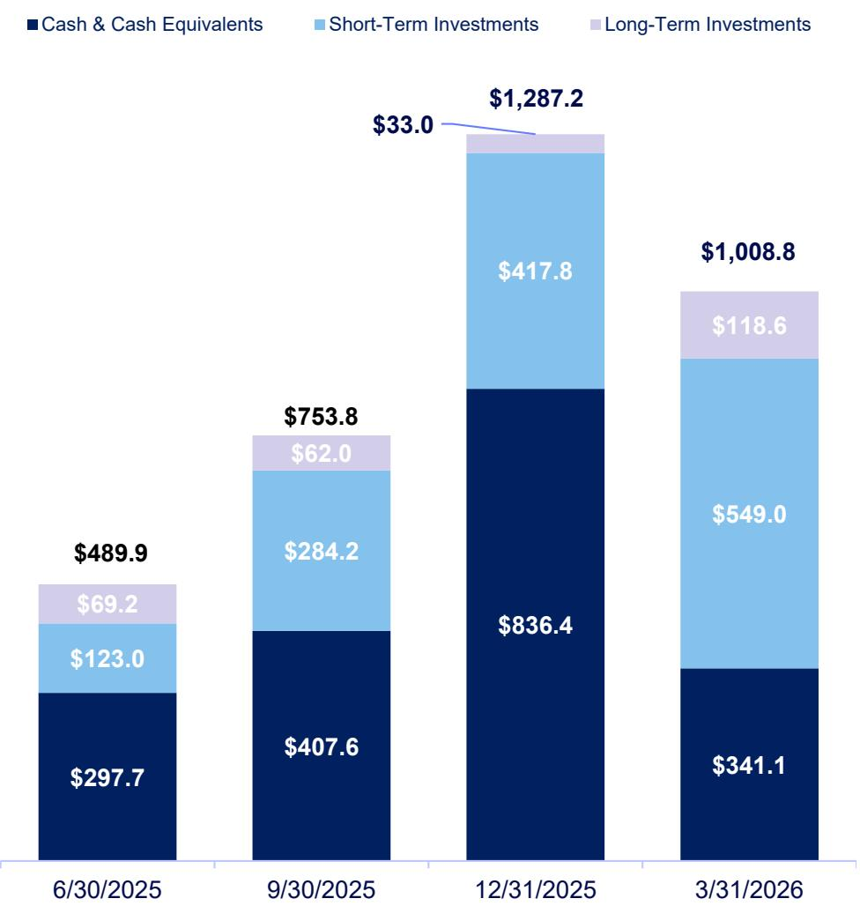

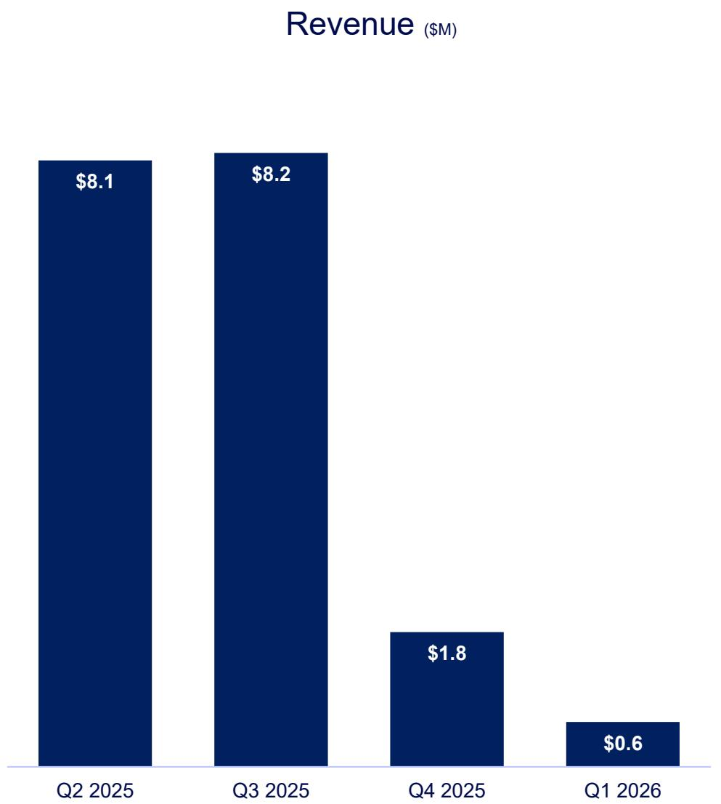

## Capitalization Summary

<table><tr><td>Share Type</td><td>Description</td><td>Mar 31, 2026</td><td>Dec 31, 2025</td></tr><tr><td>Class A Shares</td><td>NuScale Power Corporation Class A shares</td><td>323.7M</td><td>318.5M</td></tr><tr><td>Class B Shares</td><td>NuScale Power Corporation Class A shares issuable upon the exchange of one Class B share and one NuScale Power, LLC Class B unit</td><td>19.4M</td><td>19.4M</td></tr><tr><td>Total Shares Outstanding</td><td></td><td>343.1M</td><td>337.9M</td></tr><tr><td>Options</td><td>(1) NuScale Power Corporation 2022 LTIP, and(2) Legacy options converted to NuScale Power Corporation stock options</td><td>4.5M</td><td>4.7M</td></tr><tr><td>Time-Based Restricted Stock Units</td><td>NuScale Power Corporation 2022 LTIP</td><td>5.0M</td><td>4.2M</td></tr><tr><td>Total Dilutive Shares</td><td></td><td>9.5M</td><td>8.9M</td></tr><tr><td>Fully Diluted Shares</td><td></td><td>352.6M</td><td>346.8M</td></tr></table>

## NuScale Power First Quarter 2026 Q&A Session

May 2026

